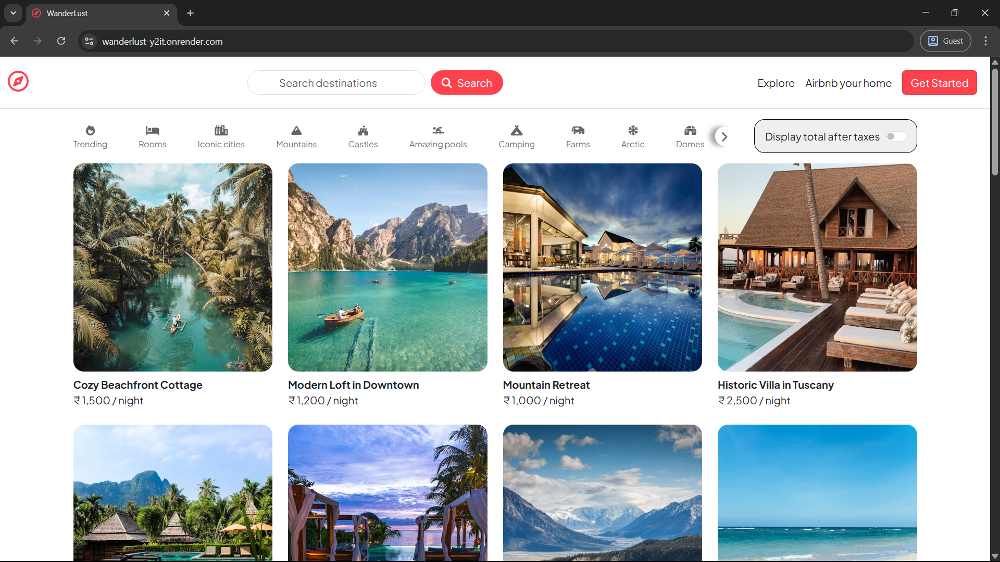
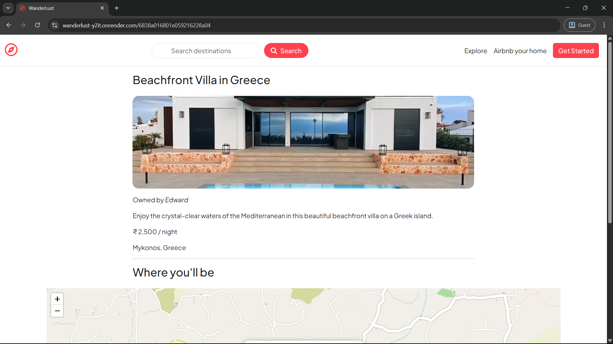
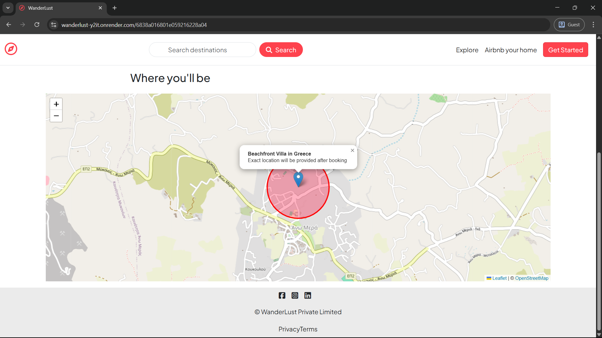
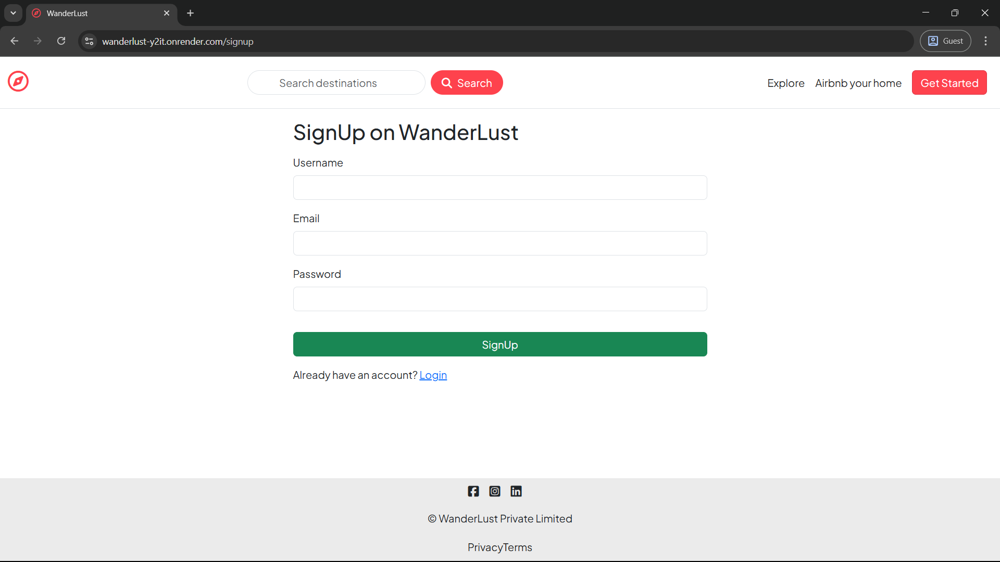
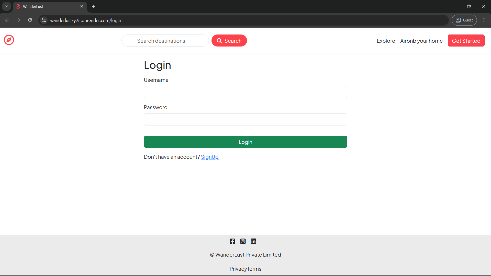
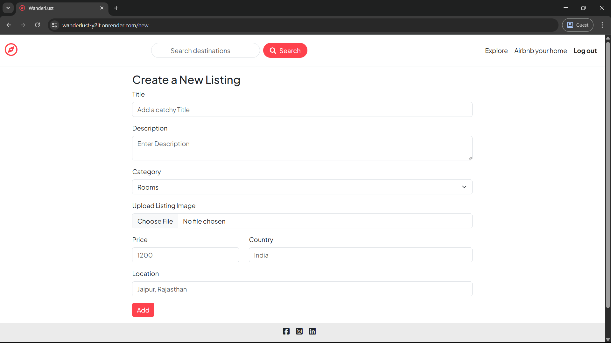
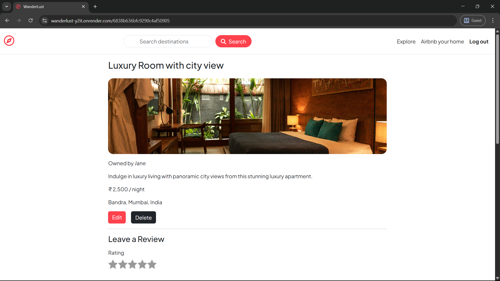
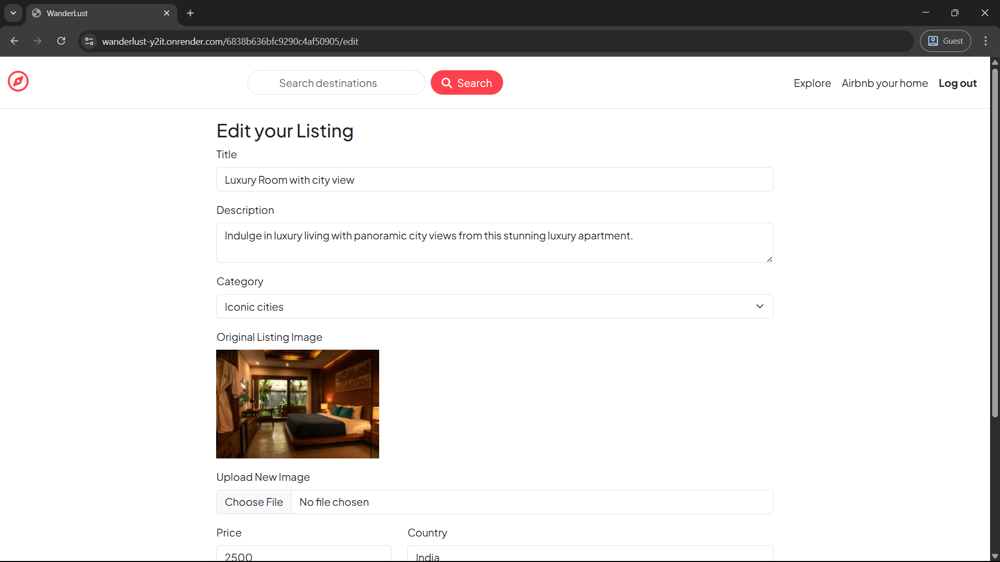
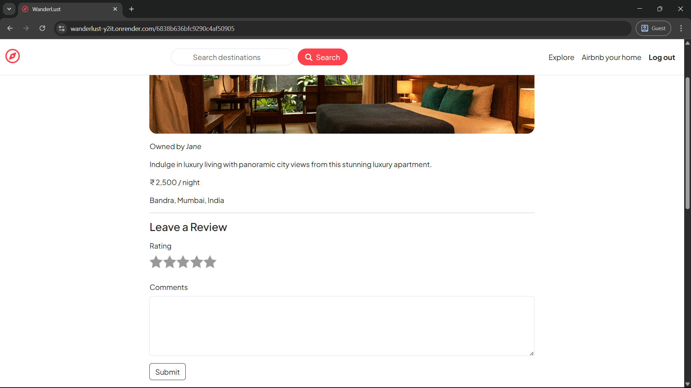
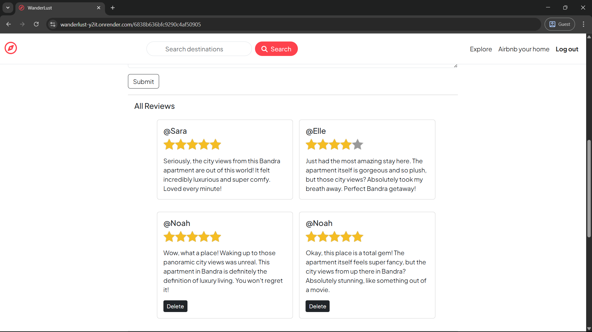

# 🏡 Wanderlust – Airbnb Clone

**Live Demo:** [https://wanderlust-y2it.onrender.com](https://wanderlust-y2it.onrender.com)

Wanderlust is a full-stack web application inspired by Airbnb. It allows users and property owners to list, explore, and manage vacation homes with features like image uploads, map-based location display, review system, and more. This project follows the **MVC architecture** and utilizes modern technologies such as Node.js, MongoDB, Passport.js, and Leaflet.

---

## ✨ Features

### 👥 Authentication & Authorization

* **Role-based access** for Users and Owners using **Passport.js**
* Secure **signup/login/logout** with session management via `express-session` and `connect-mongo`

### 🏠 Listings Management

* Owners can **create**, **edit**, and **delete** listings
* Upload listing images via **Cloudinary**
* Listings automatically display a **map** using **Leaflet** with geolocation from **OpenCage API**

### 🔍 Search & Filter

* Global **search bar** on the navbar to search listings by title, description, category, location and country
* **Category filters** on homepage for quick browsing

### 💬 Reviews System

* Users can **add** and **delete reviews** on listings
* Ratings UI using custom styling

### 🌐 Map Integration

* **Leaflet.js** for map rendering
* **OpenCage API** for geocoding user input locations

---

## 🛠️ Tech Stack

### Backend

* **Node.js** / **Express.js**
* **MongoDB Atlas** & **Mongoose**
* **Passport.js** – Authentication
* **Joi** – Schema validation
* **Cloudinary** – Image storage
* **express-session** & **connect-mongo** – Session handling

### Frontend

* **EJS** – Templating engine
* **Leaflet.js** – Map integration
* **BootStrap + CSS** – Custom scripts and styles

---

## 📁 Project Structure

```
wanderlust/
│
├── controllers/           # Route handler logic (MVC controllers)
│   ├── listings.js
│   ├── reviews.js
│   └── users.js
│
├── init/                  # Initialization data
│   ├── data.js
│   └── index.js
│
├── models/                # Mongoose schemas
│   ├── listing.js
│   ├── review.js
│   └── user.js
│
├── public/                # Static files
│   ├── icon.png
│   ├── css/
│   │   ├── index.css
│   │   ├── navbar.css
│   │   ├── rating.css
│   │   └── style.css
│   └── js/
│       ├── index.js
│       ├── map.js
│       ├── navbar.js
│       └── script.js
│
├── routes/                # Express routes
│   ├── listing.js
│   └── review.js
│
├── utils/                 # Utility functions and error handling
│   ├── ExpressError.js
│   └── wrapAsync.js
│
├── views/                 # EJS templates
│   ├── error.ejs
│   ├── includes/
│   │   ├── flash.ejs
│   │   ├── footer.ejs
│   │   └── navbar.ejs
│   ├── layouts/
│   │   └── boilerplate.ejs
│   ├── listings/
│   │   ├── edit.ejs
│   │   ├── index.ejs
│   │   ├── new.ejs
│   │   └── show.ejs
│   └── users/
│       ├── login.ejs
│       └── signup.ejs
│
├── cloudConfig.js         # Cloudinary configuration
├── middleware.js          # Custom middleware
├── schema.js              # Joi validation schemas
├── index.js               # Entry point
├── package.json           # Project metadata and dependencies
└── README.md              # Project documentation
```

---

## 🚀 Getting Started

### Prerequisites

* Node.js and npm
* MongoDB Atlas account
* Cloudinary account
* OpenCage Geocoder API key

### Installation

1. **Clone the repository**

   ```bash
   git clone https://github.com/Omashree/wanderlust.git
   cd wanderlust
   ```

2. **Install dependencies**

   ```bash
   npm install
   ```

3. **Setup environment variables**

   Create a `.env` file in the root:

   ```
   ATLASDB_URL=your_mongodb_atlas_connection_string
   CLOUD_NAME=your_cloudinary_cloud_name
   CLOUD_API_KEY=your_cloudinary_api_key
   CLOUD_API_SECRET=your_cloudinary_api_secret
   OPENCAGE_API_KEY=your_opencage_api_key
   SECRET=your_session_secret
   ```

4. **Seed the database (optional)**

   ```bash
   node init/index.js
   ```

5. **Start the server**

   ```bash
   node index.js
   ```

6. Open in browser: [http://localhost:8080](http://localhost:8080)

---

## 📸 Screenshots





















---

## 🧩 Future Improvements

* Booking functionality with calendar integration
* User profile dashboard with listing and review history
* Mobile-first design improvements
* Pagination for listings and reviews

---

## 🤝 Contributing

Contributions, bug reports, and feature requests are welcome!
Feel free to fork this repo and submit a pull request.

---

## 📄 License

This project is licensed under the **MIT License**.
See the [LICENSE](LICENSE) file for details.
